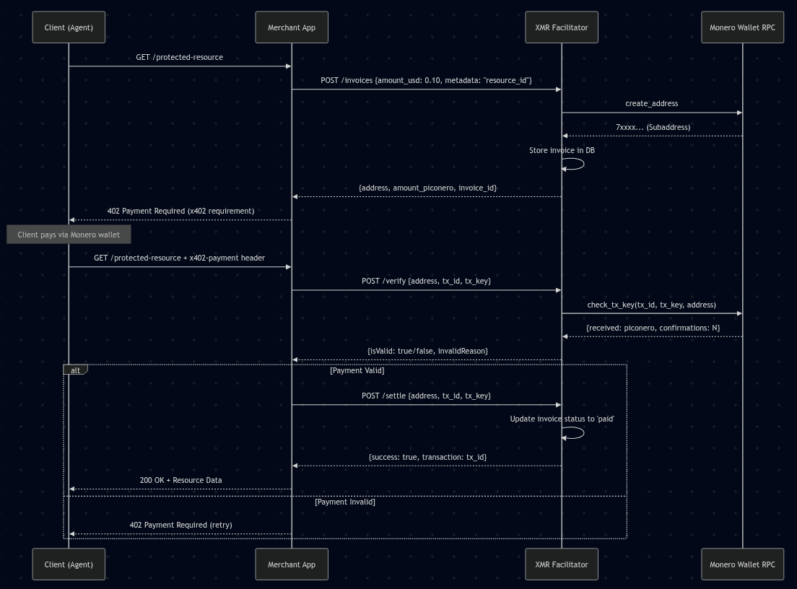

# Universal Monero x402 Facilitator (Daemon)

An open-source, privacy-respecting payment oracle that implements the **x402 (Payment Required)** protocol for Monero (XMR). 

This project acts as a **sidecar daemon** for web servers, AI agents, and microservices. It bridges the gap between the "Agentic Web" and Monero's private-by-default network, allowing any application (Go, JS, Python) to accept XMR using the Coinbase x402 standard.

## Vision
To provide a sovereign, self-hosted alternative to corporate payment facilitators. By running this daemon alongside your application, you can gate resources behind XMR micro-payments while maintaining 100% control over your own View Keys and Node infrastructure.

## Protocol Flow


1. **Merchant App** calls `/invoices` to generate a subaddress and price.
2. **Merchant App** returns a `402 Payment Required` header to the Client.
3. **Client** pays via XMR and retrieves the `tx_key` from their wallet.
4. **Client** submits `tx_id` and `tx_key` to the Merchant.
5. **Merchant App** calls `/settle` on this Facilitator to verify and unlock the resource.

## Features
- **x402 Compliant:** Implements `/supported`, `/verify`, and `/settle` endpoints.
- **Privacy Centric:** Generates unique subaddresses for every request; no address reuse.
- **Universal Sidecar:** RESTful API for creating invoices and verifying payments from any programming language.
- **Cryptographic Proof-of-Payment:** Uses Monero's `tx_key` (Transaction Secret Key) to verify sender ownership, preventing header spoofing and replay attacks.
- **Persistent Storage:** SQLite/SQLx backend tracks invoice lifecycles (Pending, Paid, Expired).
- **Dynamic Market Pricing:** Fetches real-time XMR/USD exchange rates via CoinGecko.
- **0-Conf Ready:** Scans the mempool for incoming transactions to provide an instant "Web Native" experience.
- **Privacy Centric:** Generates unique subaddresses for every request; no address reuse.

## Tech Stack
- **Language:** Rust (Axum)
- **Database:** SQLite (SQLx)
- **Crypto Integration:** Monero-Wallet-RPC
- **Pricing:** CoinGecko API

## Developer Tooling
This project includes a standard **OpenAPI 3.1** specification.

- **`openapi.yaml`**: Can be imported into Postman or used to generate client libraries in Go, TS, or Python.

## Getting Started

### Prerequisites
1. **Monero Wallet RPC:** Must be running with a wallet file loaded.
   ```bash
   monero-wallet-rpc --stagenet --rpc-bind-port 18083 --disable-rpc-login --wallet-file your_wallet
   ```
2. **Rust Toolchain:** (Cargo/Rustc)

### Installation
1. **Configure:**
   ```bash
   cp .env.example .env
   # Edit .env with your RPC URL and Database path
   ```
2. **Initialize Database:**
   ```bash
   touch facilitator.db
   sqlite3 facilitator.db "CREATE TABLE invoices (address TEXT PRIMARY KEY, amount_required INTEGER NOT NULL, metadata TEXT, status TEXT, tx_id TEXT, created_at INTEGER NOT NULL);"
   ```
3. **Build & Run:**
   ```bash
   cargo run
   ```

## Standard x402 API Reference

### 1. Supported Kinds (`GET /supported`)
Returns the network and scheme supported by this facilitator.
- **Returns:** `{"kinds": [{"x402Version": 2, "scheme": "exact", "network": "monero:stagenet"}]}`

### 2. Settle Payment (`POST /settle`)
The primary endpoint for unlocking resources.
- **Input:**
  ```json
  {
    "paymentPayload": {
      "address": "7...",
      "tx_id": "...",
      "tx_key": "..."
    },
    "paymentRequirements": {
      "scheme": "exact",
      "network": "monero:stagenet"
    }
  }
  ```
- **Returns:** `{"success": true, "transaction": "...", "network": "monero:stagenet", "payer": "anonymous"}`

---

## Merchant Helper API

### Create Invoice (`POST /invoices`)
Used by your server to prepare a challenge for the user.
- **Input:** `{"amount_usd": 0.10}`
- **Returns:** `{"address": "7...", "amount_piconero": 650000, "invoice_id": "...", "status": "pending"}`

## Security & Confirmation Levels
By default, this facilitator is configured for **0-Conf (Instant)** verification. This allows for a "Web Native" experience where resources are unlocked the moment a transaction hits the mempool.

### Configuration
You can adjust the security level in your `.env` file:
- `CONFIRMATIONS_REQUIRED=0`: Instant access. Ideal for low-value digital goods (API hits, articles).
- `CONFIRMATIONS_REQUIRED=2`: Requires the transaction to be mined and confirmed. Recommended for high-value goods to prevent double-spend/race attacks.

### The `tx_key` Proof
Because Monero is private, a transaction hash (`tx_id`) is not enough to prove ownership. This daemon requires the `tx_key` (Transaction Secret Key) from the client. The daemon uses this to verify:
1. The transaction actually sent the expected amount.
2. The transaction was sent to the correct one-time subaddress.
3. The sender actually possesses the secret key for that transaction.

## Security: The `tx_key` Advantage
Unlike transparent ledgers where seeing a transaction is enough proof, Monero's privacy requires the sender to prove they are the one who sent the funds. This facilitator requires the client to provide the `tx_key` generated by their wallet. 
- The facilitator uses `check_tx_key` via RPC to verify that the key proves a transfer to the specific subaddress.
- This ensures that users cannot "spoof" headers by simply finding high-value TXIDs on a block explorer.

## Status: Proof of Concept
- [x] Universal REST API
- [x] Cryptographic verification (tx_key)
- [x] SQLite persistence
- [ ] Webhook support (Next)
- [ ] Tor / .onion service support (Next)

## Contributing
This is an open-source project designed to strengthen the Monero ecosystem. Contributions, bug reports, and integration examples are welcome.
